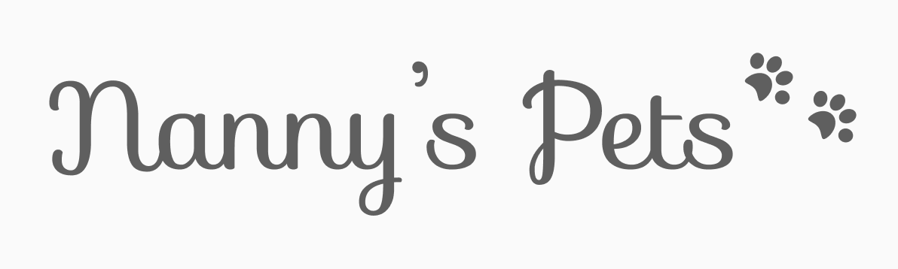

# Nanny's Pets

O projeto Nanny's Pets tem como objetivo desenvolver um sistema para o serviço de hospedagem de cachorros e gatos pela necessidade de eventual compromisso dos seus donos, deixando assim seu(s) pet(s) nas casas de hospedeiros que sejam capacitados para realizar o serviço.  

 

# Equipe e Formas de Contato

1. Anna Carolinne - [GitHub](https://github.com/anna-albuquerque) 
2. Evandro Henrique - [GitHub](https://github.com/evandrohpereira)
3. Gabriel Ricardo - [GitHub](https://github.com/gabriellldev) 
4. Maria Luiza - [GitHub](https://github.com/malucarvalho) 
5. Sérgio Henrique - [GitHub](https://github.com/sergioh665)
6. Walber Ranniere - [GitHub](https://github.com/WalberRanniere) 

**Orientador:** Gilbert Azevedo - [GitHub](https://github.com/Gilbert-Silva)   
 

# Horário de Reuniões

Reuniões duas vezes por semana às 19h geralmente às terças e quintas, às vezes mais com horários previamente acordados entre os integrantes dependendo das demandas que vão surgindo no decorrer do desenolvimento do projeto.   
 

# Ferramentas e tecnologias utilizadas no desenvolvimento do projeto:

* Github para a realizar o controle de versões do projeto.
* Figma para a prototipação em baixa, média e alta fidelidade da interface do sistema;
* ERDPlus para elaboração dos diagramas ER;
* Html 5 como linguagem de marcação;
* CSS 3 para estilizar as páginas web;
* Python + Django Framework Web da linguagem de programação Python;   
 

# Documentação

* [Documento de visão](doc/visao/doc-visao.md)
* [Mapa do Site](doc/mapa-site/SiteMap.png)
* [Diagrama Entidade-Relacionamento](doc/bd/diagramaERV2.png)
* [Modelo de Domínio](doc/dominio/dominio.md)
* [Modelo de casos de uso](/doc/cdu/Diagramas%20Casos%20de%20Uso.jpeg)
* [Protótipos de interface com o usuário](doc/prototipos/prototipos.md)

> Ir inserindo os links conforme forem sendo feitos.

# Manual da Desenvolvedor

>Descrever os comandos iniciais para começar a colaborar com o desenvolvimento do projeto...
